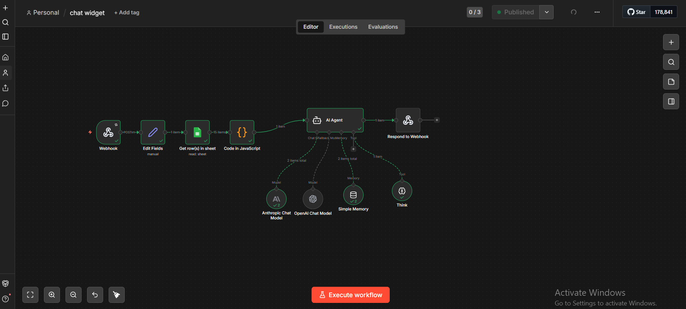

# AI Automation Engineer | n8n, GoHighLevel, APIs & Workflow Systems

Building end-to-end automation systems for marketing agencies, web hosting, clinics, and service businesses.

**Currently available for freelance and contract automation projects.**

---

## Profile

AI Automation Engineer with 2 years of experience building production-ready workflow systems using n8n (self-hosted), GoHighLevel, and API integrations. Transitioned from clinical dentistry — where I saw daily how much time was lost to scheduling, follow-ups, and repetitive patient inquiries — and built my first AI system to fix it: a multi-channel receptionist handling 90%+ of clinic inquiries without human intervention. Then expanded into marketing agencies, fitness, beauty, web hosting, and service businesses.

Every workflow I build is designed with structured logging, error monitoring, retry logic, and safe human handover — not just demos, but systems that run reliably in production.

**Currently:** AI Automation Engineer at **Hostzera** (Web Hosting & Marketing)
**Previously:** AI Automation Engineer at **OMB** (Marketing Agency, Netherlands)

**Loom Demo (Clinic AI Receptionist):** [Watch the walkthrough →](https://www.loom.com/share/5e571af3da7c41edb6a80c1c5604876d)

---

## Featured Systems

### 1. Hostzera – AI Chat Widget & Lead Automation (Current)

**Stack:** n8n · Anthropic Claude · OpenAI · Google Sheets · JavaScript · Webhooks
**Status:** Running in production since January 2026

AI-driven customer support and sales assistant for **Hostzera** (web hosting platform). Retrieves structured service data from Google Sheets, processes it through a custom retrieval layer, and feeds it into an AI agent with conversation memory. Multi-language support, automatic page linking, and zero hallucination through retrieval-only responses.

**Impact:**
- 24/7 instant responses — visitors get accurate answers without waiting for a human
- Reduced support load — common questions handled automatically
- Higher lead conversion through intelligent qualification

[View details →](./hostzera-chat-widget)

---

### 2. Lead Generation & Outreach Engine

**Stack:** n8n · Google Maps Scraper · ZeroBounce · OpenAI · Google Sheets · Gmail
**Status:** Deployed for marketing agency outreach campaigns

End-to-end pipeline: **Google Maps scraping → deduplication → email verification (ZeroBounce) → AI-personalized outreach → human approval → sending**. Every email is reviewed before it goes out. Built with retry logic, error logging, and team notifications.

**Impact:**
- Automated prospecting eliminates hours of manual research per campaign
- Verified emails protect sender reputation and ensure deliverability
- Human-in-the-loop ensures quality — no email sent without approval

[View details →](./lead-generation-system)

---

### 3. Clinic Booking System – AI Receptionist

**Stack:** n8n · OpenAI · WhatsApp / Messenger / Telegram · Google Sheets · Google Calendar
**Status:** Production system handling live patient inquiries

Replaces manual receptionist chat with an AI assistant across WhatsApp, Messenger, Instagram, and Telegram. Handles FAQs, collects patient details, books appointments, sends reminders, and logs everything into Google Sheets.

**Impact:**
- **90%+ of initial inquiries** handled end-to-end by automation
- Response time dropped to **under 2 minutes**
- Front-desk manual work reduced by **~70%**

[Watch Loom Demo →](https://www.loom.com/share/5e571af3da7c41edb6a80c1c5604876d) | [View details →](./clinic-booking-system)

---

### 4. Document Automation System

**Stack:** n8n · OpenAI · JavaScript · Google Sheets · Google Drive · Gmail
**Status:** Deployed for construction document processing

AI-assisted pipeline that transforms **construction specification PDFs** into structured Excel outputs. The LLM extracts action signals from natural-language instructions, but **all calculations are deterministic code** — no LLM math. Includes duplicate detection, quantity conservation validation, QA reporting, and full error monitoring.

**Impact:**
- Hours of manual document processing → automated pipeline runs
- Zero calculation errors — deterministic code handles all math
- Full audit trail with QA reports for every run

[View details →](./document-automation-system)

---

### 5. Holistic Wellness Club – GHL + n8n Ecosystem

**Stack:** GoHighLevel · n8n · JavaScript · WhatsApp API · Google Sheets · Google Calendar
**Status:** Full ecosystem deployed for wellness club operations

Comprehensive system combining GoHighLevel for the client journey (pipelines, workflows, calendars) and n8n as the backend brain (webhook processing, logging, error monitoring). Full lifecycle: Leads → Bookings → Attendance → No-shows → Re-engagement.

**Impact:**
- Front-desk manual work reduced by **~70%**
- Single source of truth across CRM, Calendar, and automation logs
- Dedicated error monitoring with instant team alerts

[View details →](./holistic-wellness-club)

---

### 6. Smart Marketing Lead Engine

**Stack:** n8n · OpenAI · RSS / External APIs · Slack / Email · Google Sheets
**Status:** Deployed for content marketing automation

Content-driven marketing automation: monitors RSS feeds, generates AI-assisted social posts, sends **permission requests to original authors**, and auto-publishes approved content. Ethical, permission-based approach with full tracking.

**Impact:**
- Consistent content pipeline without constant manual writing
- Permission-based — no content theft
- Full history of approvals, publications, and pending items

[View details →](./marketing-lead-engine)

---

### 7. Gym Lead Management – Trials & Memberships

**Stack:** n8n · OpenAI · WhatsApp / Instagram / Messenger · Google Sheets · Google Calendar
**Status:** Designed for gyms handling 150+ leads/month

Captures all incoming messages and turns them into a structured lead pipeline (Member / Hot / Trial / Lost). Automates trial-class booking, follow-ups, and membership conversion with AI-powered replies.

**Impact:**
- Designed to handle 150+ leads/month with full traceability
- All ad leads captured & logged instead of lost in chats
- Automatic trial reminders and membership push

[View details →](./gym-lead-management)

---

### 8. Beauty Center Reception Workflow

**Stack:** n8n · OpenAI · WhatsApp / Instagram / Messenger · Google Sheets · Google Calendar
**Status:** Multi-channel reception system for beauty businesses

24/7 digital receptionist for beauty centers. Centralizes messages from 3+ channels, suggests services, books with the right specialist, tracks preferences and visit history, and sends automated follow-ups.

**Impact:**
- 3+ channels unified into a single system
- Reduced missed messages and forgotten bookings
- Better lifetime value via cross-sell and upsell follow-ups

[View details →](./beauty-center-reception-workflow)

---

## Additional Business Use Cases

Beyond the systems above, I design custom n8n automations for private and field-based businesses:

- HVAC and maintenance companies
- Home services (cleaning, repairs, technicians)
- Small agencies and local service providers

Typical patterns: centralizing multi-channel inquiries into Google Sheets, automated calendar booking, and reminder/follow-up flows.

---

## Tech Stack

| Category | Tools |
|---|---|
| **Automation & AI** | n8n (self-hosted via Docker), GoHighLevel, Claude Code, Cursor, OpenAI API, Anthropic API, Make / Zapier |
| **CRMs & Data** | HubSpot, Zoho, Airtable, Google Sheets, Google Calendar API |
| **Messaging** | WhatsApp Business API, Meta Messenger, Instagram Direct, Telegram Bot API, Slack |
| **Programming** | JavaScript (n8n function nodes, custom logic), Python (data processing), SQL |
| **Infrastructure** | Hostinger VPS (Docker), Git/GitHub, structured logging, retry logic, error monitoring, Discord/email alerting |

---

## Where These Workflows Fit

| Industry | Use Cases |
|---|---|
| **Web Hosting** | Chat widgets, lead qualification, client onboarding, upsell automation |
| **Marketing Agencies** | Lead generation, content pipelines, campaign automation, outreach |
| **Construction & Engineering** | Document processing, specification automation, QA reporting |
| **Clinics & Medical** | Patient booking, reminders, FAQ automation |
| **Gyms & Fitness** | Lead capture, trials, membership retention |
| **Beauty & Salons** | Multi-service booking, customer follow-up |
| **Private Services** | Reception automation, lead qualification, job tracking |

---

## Work With Me

I'm currently available for freelance and contract automation projects. If you need an automation system built — or an existing one fixed — I'd love to help.

- **LinkedIn:** [Khaled Abdelaziz](https://www.linkedin.com/in/khaled-abdelaziz-20b05a393)
- **Email:** [khaledabdelaziz1330@gmail.com](mailto:khaledabdelaziz1330@gmail.com)
- **Loom Demo:** [Clinic AI Receptionist Walkthrough](https://www.loom.com/share/5e571af3da7c41edb6a80c1c5604876d)

---

## Notes

- Workflow screenshots and documentation are available in each project folder
- n8n JSON exports can be shared for technical review or test deployment
- All systems are designed with real production constraints: errors, retries, logging, monitoring, and safe handover to humans
