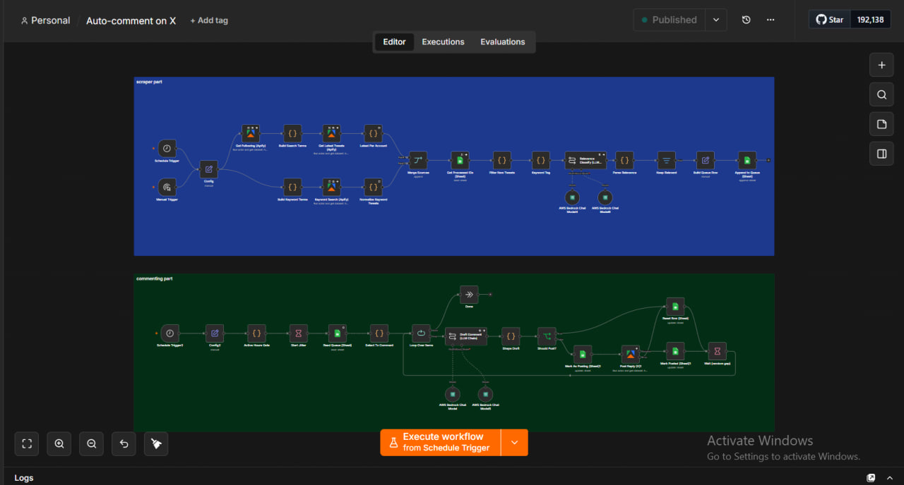
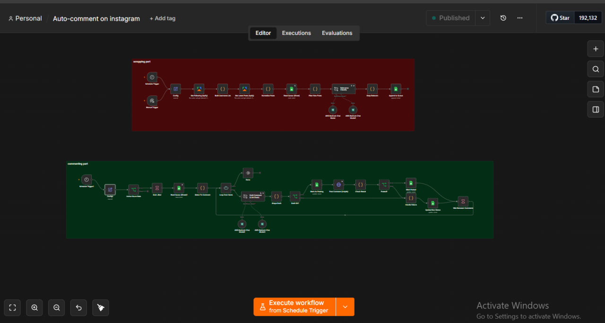
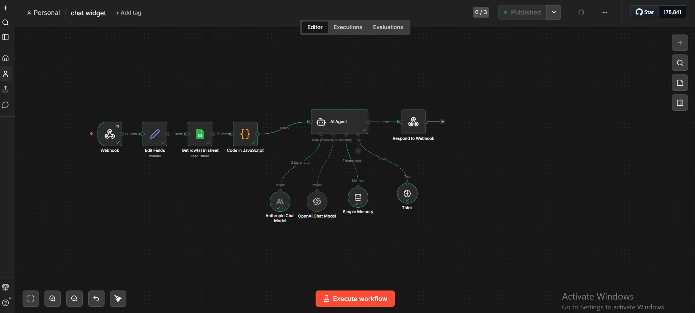
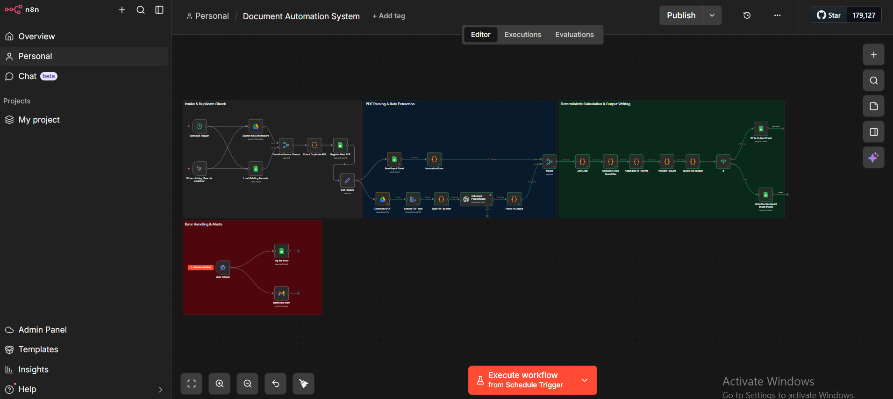
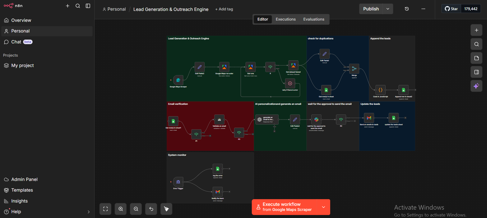
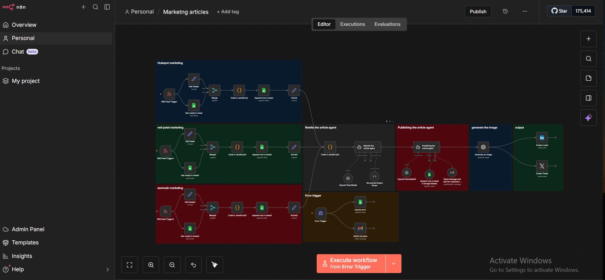

# Khaled Abdelaziz — AI Engineer

**I build AI systems that run unattended in production** — autonomous agents, LLM pipelines, and end-to-end automation systems, currently for a multinational holding group whose brands include Tadawul-listed Dar Al Arkan and LSE-listed Dar Global. Ten fully documented systems below — every one shipped with error handling, monitoring, and duplicate protection as first-class features, not afterthoughts.

---

## Profile

AI Engineer at **Quara Holding** — a multinational group spanning real estate, fintech, and digital assets, whose ecosystem includes **Tadawul-listed Dar Al Arkan, LSE-listed Dar Global**, and proptech platform **Wasalt**, operating across the GCC and Europe. I design and ship production systems end to end: AI agents, RAG workflows, integration pipelines, and CRM ecosystems built on n8n, LLM APIs (Claude, GPT, Gemini, AWS Bedrock), and GoHighLevel — accelerated by AI-assisted development (Claude Code, Cursor).

Every system here is designed with structured logging, error monitoring, retry logic, duplicate protection, and safe human handover — **systems that run reliably in production.** Bilingual Arabic/English.

**Currently:** AI Engineer at **Quara Holding** (Multinational — Real Estate, Fintech & Digital Assets)
**Previously:** AI Automation Engineer at **Hostzera** (Web Hosting, Netherlands) · **OMB** (Marketing Agency, Netherlands)

---

## How to read this portfolio

### Repository-level documents

- **[`PATTERNS.md`](./PATTERNS.md)** — Cross-cutting engineering patterns that appear across all systems (read this first to understand my approach)
- **[`SECURITY.md`](./SECURITY.md)** — How sensitive data is handled across the portfolio
- **[`LICENSE`](./LICENSE)** — MIT, with note on sanitized workflow templates

### Each project folder contains:

- **`README.md`** — what the system does, impact metrics, tech stack
- **`architecture.md`** — system design with Mermaid diagrams, design decisions, data model, failure modes
- **`code_examples.md`** — production JavaScript code samples from the actual workflow
- **`workflow.json`** — sanitized n8n workflow template (architecturally accurate, importable after credential replacement)
- **`PERFORMANCE.md`** — production performance metrics, cost analysis, reliability data, scale limits
- **Workflow diagram image** — visual representation of the n8n graph

### Selected projects also include:

- **`setup.md`** — full deployment guide (currently in clinic-booking-system)
- **`examples/`** — sanitized sample conversations, error reports, and KPI dashboards from real production (currently in clinic-booking-system)

Code samples follow real production patterns: error handling, retry logic, idempotency, sanitization, validation. They are sanitized of client-specific data but otherwise show the actual approach used. *(The two newest systems — the X and Instagram engagement agents — currently ship with README + workflow diagram; full architecture docs are on the way.)*

---

## Featured Systems

### 1. Autonomous X (Twitter) Engagement Agent

**Stack:** n8n · AWS Bedrock (LLM) · Apify · Google Sheets · JavaScript
**Status:** Ran fully unattended in production for a climate-tech brand

Two linked workflows discover relevant X posts (following-list + ~20 keyword searches), judge every candidate with an **AWS Bedrock relevance classifier** (structured JSON verdicts, fail-closed parsing), then draft and post on-brand expert replies — under strict caps (24/day, 1 per author), active-hours gating, randomized pacing, a similarity gate against near-duplicate replies, and a pre-post row lock that makes double-posting impossible.

**Impact:**
- Replaces **~2–4 hours/day of skilled engagement work**, fully unattended
- ~15–40 relevant posts discovered and queued daily; up to 24 expert replies/day
- Three-layer relevance filtering — cheap pre-filters → LLM classification → hard gate

[View details →](./x-engagement-system)

---

### 2. Autonomous Instagram Engagement Agent

**Stack:** n8n · AWS Bedrock (LLM) · Apify · Unipile API · Google Sheets
**Status:** Full engagement lifecycle automated for a climate-tech brand

Scraper + Commenter workflows sharing one Google Sheet as queue, status tracker, and dedup memory. All scraping runs **off-account** on Apify's infrastructure; the account performs only one low-volume action — posting the comment — through Unipile's managed-session API. Five-layer duplicate protection, a **self-healing queue** that reclaims orphaned rows after crashes, and a state machine (`needs_comment → posting → posted / failed`) with terminal failure after 3 attempts.

**Impact:**
- Full engagement lifecycle — discovery → relevance filtering → drafting → posting — with zero manual steps
- Conservative governance: 12/day, 1 per author/day, human active hours, randomized gaps
- Never loops, never duplicates, self-recovers from restarts

[View details →](./instagram-engagement-system)

---

### 3. Hostzera — AI Chat Widget

**Stack:** n8n · Anthropic Claude · OpenAI · Google Sheets · JavaScript · Webhooks
**Status:** Running in production since January 2026

AI-driven customer support and sales assistant for **Hostzera** (web hosting platform, Netherlands). Retrieves structured service data from Google Sheets, processes it through a custom retrieval layer, and feeds it into an AI agent with conversation memory. Multi-language support, automatic page linking, and **zero hallucination through retrieval-only responses**.

**Impact:**
- 24/7 instant responses — visitors get accurate answers without waiting for a human
- Reduced support load — common questions handled automatically
- Higher lead conversion through intelligent qualification

[View details →](./hostzera-chat-widget) · [Architecture →](./hostzera-chat-widget/architecture.md) · [Code →](./hostzera-chat-widget/code_examples.md)

---

### 4. Document Automation — PDF to Excel

**Stack:** n8n · OpenAI · JavaScript · Google Sheets · Google Drive · Gmail
**Status:** Deployed for construction document processing

AI-assisted pipeline that transforms **construction specification PDFs** into structured Excel outputs. The LLM extracts action signals from natural-language instructions, but **all calculations are deterministic code** — no LLM math. Includes duplicate detection, quantity conservation validation, QA reporting, and full error monitoring.

**Core principle:** AI for language, code for math. This eliminates the entire category of "AI hallucinated a number" bugs.

**Impact:**
- Hours of manual document processing → automated pipeline runs
- **Zero calculation errors** — deterministic code handles all math
- Full audit trail with QA reports for every run

[View details →](./document-automation-system) · [Architecture →](./document-automation-system/architecture.md) · [Code →](./document-automation-system/code_examples.md)

---

### 5. Clinic AI Receptionist

**Stack:** n8n · OpenAI · WhatsApp / Messenger / Telegram / Instagram · Google Sheets · Google Calendar
**Status:** Production system handling live patient inquiries

Replaces manual receptionist chat with an AI assistant across WhatsApp, Messenger, Instagram, and Telegram. Handles FAQs, collects patient details, books appointments, sends reminders, and logs everything into Google Sheets. Bilingual Arabic/English with dialect handling.

**Impact:**
- **90%+ of initial inquiries** handled end-to-end by automation
- Response time dropped to **under 2 minutes**
- Front-desk manual work reduced by **~70%**
- No-show rate dropped from 18% to 6% after reminder system

[View details →](./clinic-booking-system) · [Architecture →](./clinic-booking-system/architecture.md) · [Setup guide →](./clinic-booking-system/setup.md) · [Code →](./clinic-booking-system/code_examples.md)

---

### 6. Lead Generation & AI Outreach Engine

**Stack:** n8n · Apify (Google Maps Scraper) · ZeroBounce · OpenAI · Google Sheets · Gmail
**Status:** Deployed for marketing agency outreach campaigns

End-to-end pipeline: **Google Maps scraping → deduplication → email verification (ZeroBounce) → AI-personalized outreach → human approval → sending**. Every email is reviewed before it goes out. Built with retry logic, error logging, and team notifications.

**Impact:**
- Automated prospecting eliminates hours of manual research per campaign
- Verified emails protect sender reputation and ensure deliverability
- Human-in-the-loop ensures quality — no email sent without approval

[View details →](./lead-generation-system) · [Architecture →](./lead-generation-system/architecture.md) · [Code →](./lead-generation-system/code_examples.md)

---

### 7. Wellness Club — GHL + n8n

**Stack:** GoHighLevel · n8n · JavaScript · WhatsApp API · Google Sheets · Google Calendar
**Status:** Full ecosystem deployed for wellness club operations

Comprehensive system combining GoHighLevel for the client journey (pipelines, workflows, calendars) and n8n as the backend brain (webhook processing, logging, error monitoring). Full lifecycle: Leads → Bookings → Attendance → No-shows → Re-engagement.

**Pattern:** GHL handles what it does well (client journeys), n8n handles what it does well (custom logic, observability, integration glue).

**Impact:**
- Front-desk manual work reduced by **~70%**
- Single source of truth across CRM, Calendar, and automation logs
- Dedicated error monitoring with instant team alerts
- Idempotent webhook handling — no duplicate entries from GHL retries

[View details →](./holistic-wellness-club) · [Architecture →](./holistic-wellness-club/architecture.md) · [Code →](./holistic-wellness-club/code_examples.md)

---

### 8. Marketing Content Pipeline

**Stack:** n8n · OpenAI · RSS / External APIs · Gmail · Google Sheets
**Status:** Deployed for content marketing automation

Content-driven marketing automation: monitors RSS feeds, generates AI-assisted social posts, sends **permission requests to original authors**, and auto-publishes approved content. Ethical, permission-based approach with full tracking.

**Why permission-based:** Standard content automation scrapes and republishes. This system asks first. Authors often appreciate being asked, share the rewrite themselves, and the engagement multiplies.

**Impact:**
- Consistent content pipeline without constant manual writing
- Permission-based — no content theft
- Full history of approvals, publications, and pending items
- Multiple safety checks before any post goes live

[View details →](./marketing-lead-engine) · [Architecture →](./marketing-lead-engine/architecture.md) · [Code →](./marketing-lead-engine/code_examples.md)

---

### 9. Gym Lead Management

**Stack:** n8n · OpenAI · WhatsApp / Instagram / Messenger · Google Sheets · Google Calendar
**Status:** Designed for gyms handling 150+ leads/month

Captures all incoming messages and turns them into a structured lead pipeline (New → Hot → Trial Booked → Attended → Member / Lost). Automates trial-class booking, follow-ups, and membership conversion with AI-powered replies. Full state machine with explicit transitions and cancellation triggers.

**Impact:**
- Designed to handle 150+ leads/month with full traceability
- All ad leads captured & logged instead of lost in chats
- Automatic trial reminders and membership push
- 3-step no-show recovery sequence (~20% successful re-engagement)

[View details →](./gym-lead-management) · [Architecture →](./gym-lead-management/architecture.md) · [Code →](./gym-lead-management/code_examples.md)

---

### 10. Beauty Center AI Reception

**Stack:** n8n · OpenAI · WhatsApp / Instagram / Messenger · Google Sheets · Google Calendar
**Status:** Multi-channel reception system for beauty businesses

24/7 digital receptionist for beauty centers. Centralizes messages from 3+ channels, matches services from informal language, books with the right specialist, tracks preferences and visit history, and sends service-aware follow-ups. Multi-branch routing supported.

**Impact:**
- 3+ channels unified into a single system
- Service-aware follow-up cadence (haircut every 4 weeks, facial every 6, etc.)
- Preference accumulation — each visit makes the next more personal
- Multi-branch routing respects client's preferred location

[View details →](./beauty-center-reception-workflow) · [Architecture →](./beauty-center-reception-workflow/architecture.md) · [Code →](./beauty-center-reception-workflow/code_examples.md)

---

## Cross-cutting design principles

These principles appear in every system in this portfolio:

1. **AI handles language, code handles math** — eliminates the hallucinated-number error class entirely
2. **Schema normalization at the edge** — multi-channel inputs unified before any downstream processing
3. **Error triggers on every critical node** — silent failures are the #1 cause of broken production automation
4. **Human-in-the-loop where it matters** — approval gates for outbound emails, escalation paths for uncertain AI responses
5. **Idempotency for webhook reliability** — handles retry behavior gracefully
6. **Sanitized logging** — sensitive data scrubbed before any log or alert
7. **Documentation as deliverable** — non-technical users can read setup guides and understand what's running

---

## Additional Business Use Cases

Beyond the systems above, I design custom n8n automations for private and field-based businesses:

- HVAC and maintenance companies
- Home services (cleaning, repairs, technicians)
- Small agencies and local service providers

Typical patterns: centralizing multi-channel inquiries into Google Sheets, automated calendar booking, and reminder/follow-up flows.

---

## Tech Stack

| Category | Tools |
|---|---|
| **AI & LLMs** | AWS Bedrock, Anthropic Claude, OpenAI GPT, Google Gemini · RAG pipelines · structured-output prompting · Claude Code, Cursor |
| **Automation & Orchestration** | n8n (self-hosted via Docker), GoHighLevel, Make / Zapier |
| **Data & Scraping** | Apify (X, Instagram, Google Maps actors), Clay, LinkedIn Sales Navigator, ZeroBounce, Twilio Lookup |
| **CRMs & Storage** | HubSpot, Zoho, Airtable, Google Sheets, Google Calendar API |
| **Messaging & Posting** | WhatsApp Business API, Meta Messenger, Instagram (Unipile managed API), Telegram Bot API, Slack |
| **Programming** | JavaScript (n8n function nodes, custom logic), Python (data processing), SQL |
| **Infrastructure** | Hostinger VPS (Docker), Git/GitHub, structured logging, retry logic, error monitoring, Discord/email alerting |

---

## Where These Workflows Fit

| Industry | Use Cases |
|---|---|
| **Enterprise & Groups** | Lead intelligence pipelines, AI agents, internal AI tooling, compliant data enrichment |
| **Brands & Social** | Autonomous engagement agents, content pipelines, brand-voice LLM systems |
| **Web Hosting** | Chat widgets, lead qualification, client onboarding, upsell automation |
| **Marketing Agencies** | Lead generation, content pipelines, campaign automation, outreach |
| **Construction & Engineering** | Document processing, specification automation, QA reporting |
| **Clinics & Medical** | Patient booking, reminders, FAQ automation |
| **Gyms, Beauty & Services** | Lead capture, multi-service booking, retention automation |

---

## Get in Touch

Curious how one of these systems works under the hood — or facing an automation problem worth solving? I'm always happy to talk.

- **LinkedIn:** [Khaled Abdelaziz](https://www.linkedin.com/in/khaledabdelaziz-ai)
- **Email:** [khaledabdelaziz1330@gmail.com](mailto:khaledabdelaziz1330@gmail.com)

---

## Notes

- All systems are designed with real production constraints: errors, retries, logging, monitoring, and safe handover to humans
- Workflow JSON files in each folder are **sanitized templates** — they show the architecture and node connections but reference placeholder credentials and Sheet IDs that need to be replaced with your own before deployment
- Code samples in `code_examples.md` files represent the production patterns used in each system
- For full unsanitized JSON or technical review, please reach out
