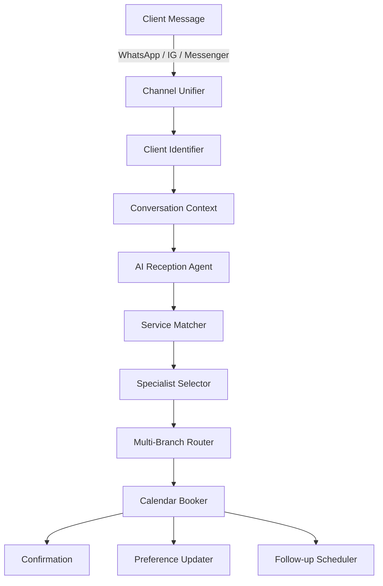
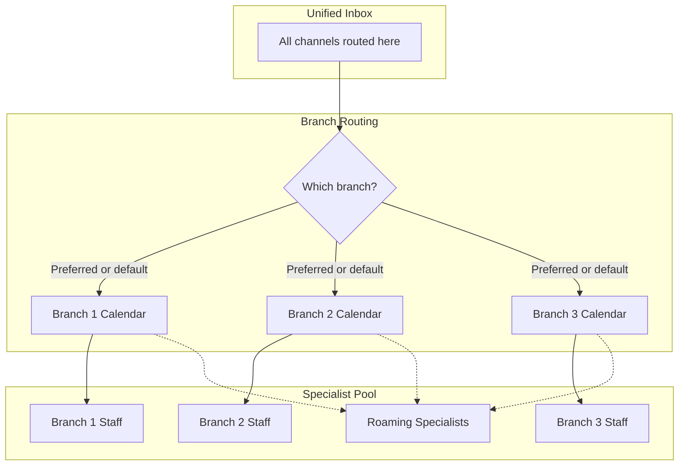
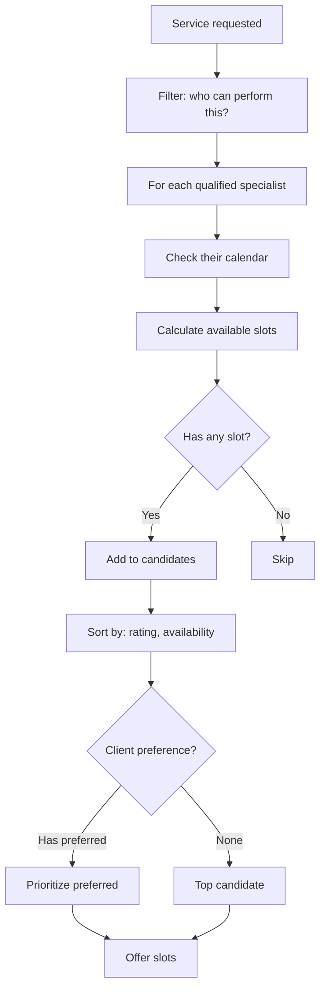
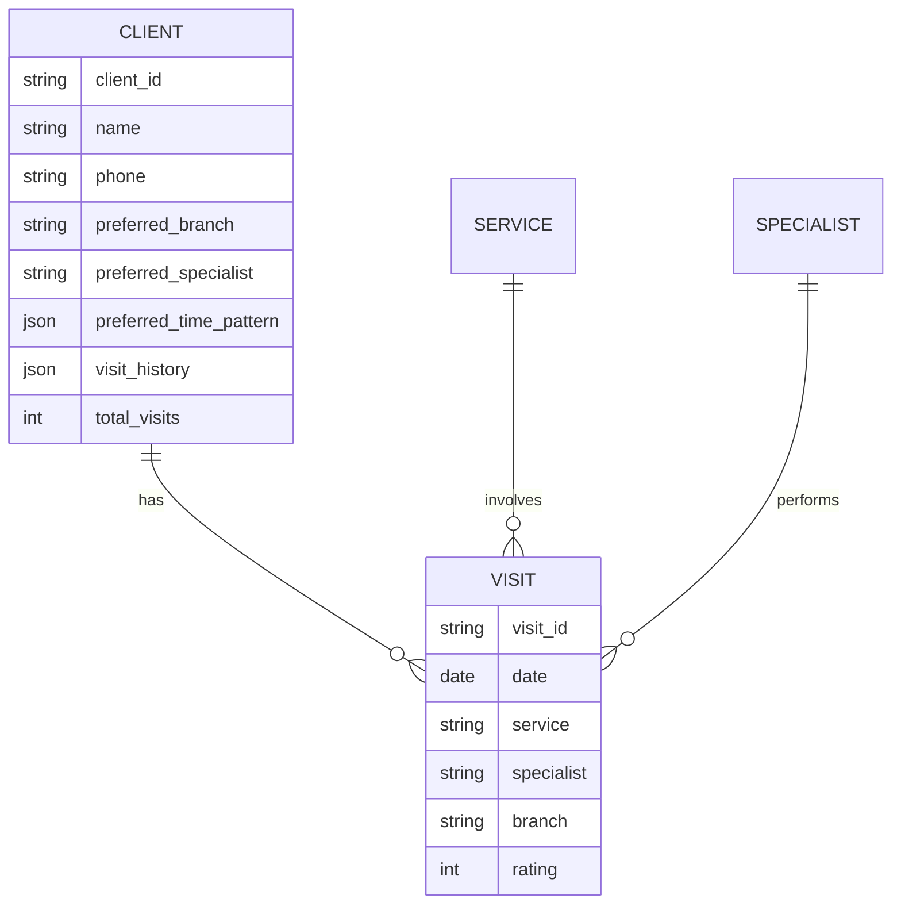
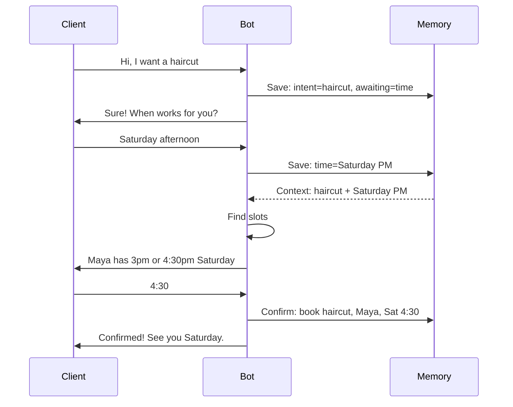

# Architecture — Beauty Center AI Reception

Multi-channel reception system unifying 3+ messaging channels for beauty and wellness service businesses. Handles service matching, specialist booking, multi-branch routing, and preference-based personalization.

---

## System overview



## Multi-branch architecture



## Service matching strategy

Beauty services have many informal names. The matcher handles them.

```mermaid
flowchart LR
    A[User: "I need a wash and trim"] --> B[Tokenize]
    B --> C[Match against keywords]
    C --> D{Single match?}
    D -->|Yes| E[Confirmed Service]
    D -->|No, ambiguous| F[Ask Clarification]
    D -->|No matches| G[Show Service Menu]
    F --> H[User selects]
    G --> H
    H --> E
```

**Service keyword examples:**

| Service | Keywords |
|---|---|
| Haircut | haircut, trim, cut, hair cut, fix my hair |
| Color | color, dye, highlights, balayage, ombre, root touch up |
| Manicure | manicure, nails, mani, gel, polish, nail art |
| Pedicure | pedicure, feet, pedi, toes |
| Facial | facial, face treatment, skincare, cleansing |
| Waxing | wax, waxing, eyebrow, leg wax, brazilian |

## Specialist matching



## Preference tracking model

Every visit updates the client's preference model:



**What gets learned over time:**
- Preferred specialist (with confidence based on visit count)
- Preferred time of week (morning weekday vs Saturday afternoon, etc.)
- Preferred branch (if multi-location)
- Service combinations often booked together
- Average gap between visits per service

This drives proactive recommendations: *"Hi Sarah, it's been 4 weeks since your last cut — should I book you with Maya again this Saturday morning?"*

## Service-aware follow-up cadence

Different services have different natural rebooking windows:

| Service | Typical rebook timing |
|---|---|
| Haircut | ~4 weeks |
| Color/Highlights | ~6 weeks (root touch-up) |
| Manicure | ~2 weeks |
| Facial | ~6 weeks |
| Waxing | ~3 weeks |
| Lashes | ~3 weeks |
| Massage | ~4 weeks |

The system schedules personalized rebook reminders at the right cadence for the service the client received.

## Conversation context preservation



## Reliability features

- **Multi-channel unification** — no client lost between WhatsApp and Instagram
- **Conversation memory** — context across multiple message turns
- **Specialist scheduling conflicts** — prevented by calendar check before offering
- **Preference graceful degradation** — if preferred specialist unavailable, system offers alternatives with reasoning
- **Multi-branch routing** — respects client's preferred location
- **Error monitoring** — Slack alerts on any failure
- **Follow-up cancellation** — auto-cancels if client already rebooked

## Performance characteristics

- **Channels unified:** 3+ (WhatsApp, Instagram, Messenger, optionally Telegram)
- **Average response time:** Under 2 minutes
- **Booking conversion (DM to confirmed appointment):** ~75%
- **Client retention via follow-ups:** Estimated 25% lift in rebook rate
- **Manual reception workload reduction:** ~60-70%
