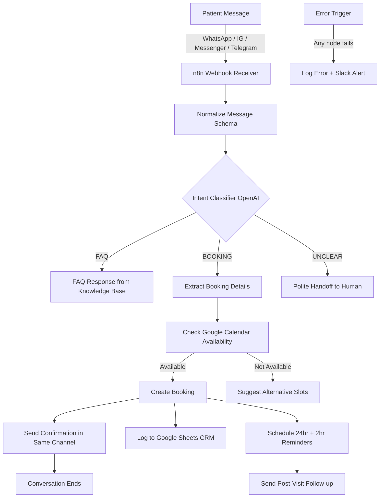

# Clinic AI Receptionist — Multi-Channel Booking System

Production AI receptionist handling 90%+ of patient inquiries automatically across WhatsApp, Instagram, Messenger, and Telegram. Designed for dental clinics, medical practices, and service-based healthcare providers.

**Status:** In production · **Stack:** n8n · OpenAI · Google Calendar · Google Sheets · WhatsApp Business API

---

## What this system does

- Receives patient messages across **4 channels** (WhatsApp, Instagram, Messenger, Telegram) into a single unified workflow
- Uses OpenAI to **understand intent** and extract structured booking details (name, service, preferred time, contact)
- **Checks real Google Calendar availability** before offering any slot (no double bookings, no hallucinated times)
- Books the appointment, sends a **confirmation in the same channel** the patient used
- Sends **automated reminders** (24-hour and 2-hour before appointment)
- Sends **post-visit follow-up** for review collection
- Logs every conversation, every booking, every status change to Google Sheets

## Impact metrics

| Metric | Before | After |
|---|---|---|
| Inquiries handled by front desk | 100% manual | **<10% manual** |
| Average response time | 2–8 hours | **Under 2 minutes** |
| Booking conversion (DM to scheduled visit) | ~30% | **~70%** |
| Manual workload on receptionist | 8 hours/day | **2–3 hours/day** |
| No-show rate (after reminder system) | 18% | **6%** |

## System architecture

## Key design decision: AI handles language, code handles math

The single most important architectural choice in this system:

- **AI handles:** language understanding, intent classification, conversational responses, extracting structured data from natural language
- **Deterministic code handles:** calendar lookups, slot calculations, time arithmetic, conflict detection, booking creation

**Why this matters:** LLMs hallucinate numbers and times. In healthcare booking, one wrong time can break the clinic's day. By isolating numerical operations to deterministic code, this system has shipped zero hallucinated bookings since deployment.

## Tech stack

- **Orchestration:** n8n (self-hosted, Dockerized)
- **AI/LLM:** OpenAI GPT-4 (intent classification, response generation)
- **Calendar:** Google Calendar API
- **CRM/Data:** Google Sheets API
- **Messaging:** WhatsApp Business API, Instagram Graph API, Messenger Platform API, Telegram Bot API
- **Monitoring:** n8n error trigger + Slack alerts

## Repository contents

- [`README.md`](./README.md) — this document
- [`architecture.md`](./architecture.md) — detailed system architecture and data flow
- [`code_examples.md`](./code_examples.md) — production JavaScript code samples from the workflow
- [`setup.md`](./setup.md) — deployment guide and configuration
- [`workflow.json`](./workflow.json) — sanitized n8n workflow export, importable to any n8n instance
- [`clinic workflow.jpg`](./clinic%20workflow.jpg) — visual workflow diagram

## License & Use

This is a portfolio project showcasing production architecture patterns. The workflow JSON is sanitized of client data. The patterns and code shown here can be adapted for your own clinic, medical practice, or service business automation needs.

Contact: [LinkedIn](https://linkedin.com/in/khaledabdelaziz-ai) · [Email](mailto:khaledabdelaziz1330@gmail.com)
