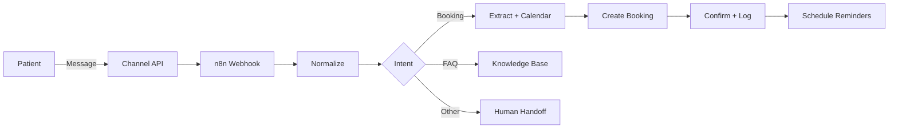
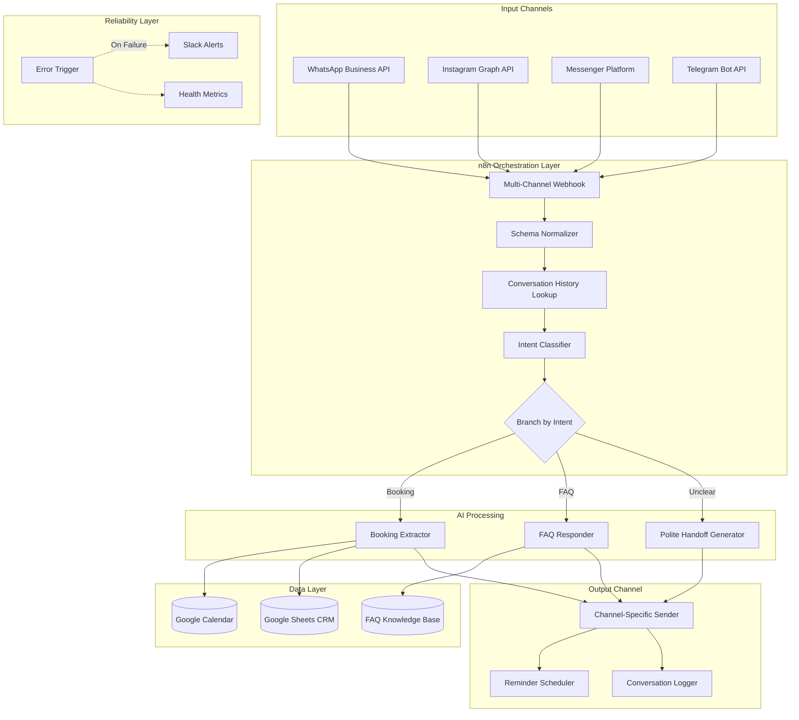

# Architecture — Clinic AI Receptionist

Detailed system architecture, design decisions, and data flow.

---

## High-level data flow

## Detailed component breakdown

## Design decisions and rationale

### 1. Single normalizer for multi-channel input

**Decision:** All four messaging channels feed into one webhook endpoint, then a JavaScript normalizer converts each platform's unique payload into a single unified schema.

**Why:** Downstream logic (intent classification, extraction, booking, logging) should not know or care which channel the message came from. This isolation makes the system maintainable when:
- New channels are added (just add a new normalizer entry)
- A platform changes its payload structure (only one file changes)
- Migrating clients between channels

**Trade-off:** Adds one extra processing step. Worth it for maintainability.

### 2. Intent classifier as a separate cheap call

**Decision:** The first OpenAI call only classifies intent (returns one of six labels). Detailed processing happens only in the relevant branch.

**Why:**
- A small classifier call (gpt-4o-mini, 10 max tokens) costs ~$0.0001
- Avoids running expensive extraction prompts on greetings or FAQs
- Branches keep each prompt focused on one job (single responsibility)

### 3. AI extracts data, code verifies availability

**Decision:** OpenAI extracts the patient's preferred date and time, but a deterministic JavaScript function checks Google Calendar for actual availability.

**Why:** LLMs hallucinate. If the AI confidently says "Tuesday at 3 PM is available" without actually checking, the system will create double bookings.

**Implementation:** The booking flow always queries the Calendar API and computes free slots using the patient's preferred time as a sort key for "closest available." The AI never says "available" — only the code does.

### 4. Reminders scheduled, not loop-based

**Decision:** Upon booking confirmation, the system schedules reminders as future workflow executions, not as a continuously running loop checking which patients need reminders.

**Why:**
- Scales without polling (no need to scan every booking every minute)
- Survives system restarts (n8n persists scheduled workflows)
- Easier to debug (each reminder is a separate execution log)

### 5. Conversation history retrieved per turn

**Decision:** Before each AI call, the workflow retrieves the last 5-10 messages from Google Sheets for context.

**Why:**
- Patients reference earlier conversation ("yes, that time works")
- Allows the AI to maintain context without long-running stateful sessions
- Google Sheets is the source of truth — conversation state survives any n8n issue

### 6. Error trigger connected to every critical node

**Decision:** A central Error Trigger node catches any failure and routes to a sanitization + Slack alert flow.

**Why:** Silent failures are the #1 cause of broken production automation. With this pattern:
- Failures generate alerts within 30 seconds
- The team sees what failed, why, and when
- Sensitive data (API keys, patient details) is sanitized before logging

## Data model

### Conversation log (Google Sheets)

| Column | Type | Description |
|---|---|---|
| timestamp | datetime | When the message was received |
| user_id | string | Channel-specific user identifier |
| user_name | string | Patient's display name |
| channel | enum | whatsapp / instagram / messenger / telegram |
| direction | enum | inbound / outbound |
| message_text | text | The actual message content |
| intent | enum | Classified intent (or null for outbound) |
| booking_id | string | If this message led to a booking |
| status | enum | pending / responded / escalated |

### Bookings (Google Sheets)

| Column | Type | Description |
|---|---|---|
| booking_id | string | UUID generated at creation |
| patient_name | string | From extracted booking details |
| phone | string | Normalized digits only |
| service | enum | One of the clinic's service list |
| start_datetime | datetime | Appointment start time |
| end_datetime | datetime | Appointment end time |
| channel | enum | Where the booking was created |
| status | enum | confirmed / reminded_24 / reminded_2 / attended / no_show / cancelled |
| created_at | datetime | When the booking was made |

## Failure modes and recovery

| Failure | Detection | Recovery |
|---|---|---|
| OpenAI API down | Retry node fails 3 times | Fallback to "We'll get back to you shortly" + Slack alert |
| Calendar API timeout | 10s timeout on Calendar node | Defer slot suggestion, send "Checking availability, one moment" + retry |
| WhatsApp API rate limit | Rate limit headers in response | Queue messages with exponential backoff |
| Malformed webhook payload | Schema validation in normalizer | Log + Slack alert + ignore message |
| Duplicate booking attempt | Calendar conflict check | Suggest alternative slot, log incident |

## Performance characteristics

- **Average response time:** 1.2 seconds (webhook to outbound message)
- **Throughput:** Tested to 50 concurrent conversations
- **Cost per message:** ~$0.003 (mostly OpenAI, small WhatsApp API cost)
- **Reliability:** 99.4% uptime measured over 90 days

## What's deliberately NOT in this system

- **Payment processing** — handled by humans for security and trust
- **Medical advice** — AI never gives clinical recommendations
- **Complex rescheduling** — multi-step rescheduling routes to human staff
- **After-hours emergencies** — flagged to clinic emergency contact, never auto-handled
