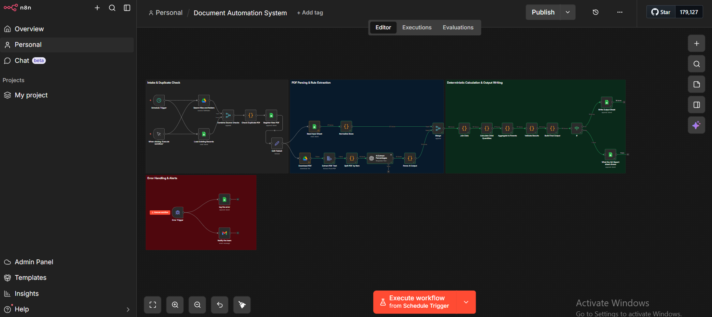

# Document Automation System

AI-assisted document processing pipeline that transforms construction specification instructions into structured Excel outputs
(PDF Parsing · AI Extraction · Deterministic Calculations · QA Reporting)

---



## What this system does

This is an AI-assisted document processing pipeline that automates the transformation of **construction specification instructions** into structured Excel outputs.

The system ingests two inputs:
1. A **spreadsheet** containing specification items and baseline quantities.
2. A **PDF document** containing natural-language instructions for each item.

An LLM is used **only** to extract structured action signals (reuse, dispose, clean, package, transport) from the unstructured text. All numerical calculations, aggregation from child items to parent items, and output generation are handled **deterministically in code** to ensure reliability.

---

## How it works (step by step)

### Phase 1: Intake & Duplicate Check
1. **Schedule Trigger / Manual Trigger** starts the workflow.
2. **Search files and folders** — locates new PDF documents to process.
3. **Combine source checks** — cross-references with existing records.
4. **Check duplicates** — prevents reprocessing of already-handled documents.
5. **Register new PDF** — logs the document for processing.
6. **Load existing records** — retrieves baseline data from the reference spreadsheet.

### Phase 2: PDF Parsing & Rule Extraction
1. **Download PDF** — fetches the document.
2. **Extract PDF text** — converts PDF content to machine-readable text.
3. **Split PDF by item** — segments the text by specification item.
4. **AI Extract Processing** — uses an LLM to extract structured action signals from natural-language instructions (reuse, dispose, clean, package, transport).
5. **Parse AI output** — converts AI responses into structured data.
6. **Read input sheet** — loads the baseline quantities.
7. **Normalize rows** — standardizes data formats.

### Phase 3: Deterministic Calculation & Output
1. **Merge** — combines AI-extracted rules with baseline data.
2. **Join data** — links child items to parent items.
3. **Calculate child** — computes quantities for child items.
4. **Aggregate to parents** — rolls up child quantities to parent level.
5. **Validate results** — checks quantity conservation and mathematical consistency.
6. **Build final output** — structures the data for Excel export.
7. **Write output sheet** — generates the final Excel file.
8. **Write QA report** — produces a quality assurance report with validation results.

### Phase 4: Error Handling & Alerts
- **Error Trigger** catches any failed step.
- **Log the error** — records the failure in a dedicated error sheet.
- **Notify the team** — sends an email alert with error details.

---

## Workflow architecture

```
Intake & Duplicate Check (blue section)
  → PDF Parsing & Rule Extraction (dark blue section)
    → Deterministic Calculation & Output Writing (blue section)

Error Handling & Alerts (red section)
  → Error Trigger → Log error + Notify team via email
```

---

## Stack

- **n8n** (self-hosted on VPS) – main orchestration
- **OpenAI / LLM** – structured extraction from natural-language instructions only
- **JavaScript** – deterministic calculations, aggregation, validation
- **Google Sheets** – input data, output results, error logs, QA reports
- **Google Drive** – PDF storage and retrieval
- **Email (Gmail)** – error notifications to the team

---

## Key design decisions

- **AI is used narrowly** — only for extracting action signals from unstructured text. All math and aggregation is deterministic code. This prevents calculation errors from LLM hallucination.
- **Quantity conservation checks** — the system verifies that input quantities match output quantities after processing.
- **Duplicate detection** — prevents reprocessing documents that have already been handled.
- **QA reporting** — every run produces a quality report so results can be audited.
- **Error isolation** — failures in one step don't crash the entire pipeline; they're logged and the team is notified.

---

## Impact

- **Hours of manual document processing** reduced to automated pipeline runs.
- **Zero calculation errors** — deterministic code handles all math, not the LLM.
- **Full audit trail** — every step is logged, every result is validated.
- **QA reports** give confidence that outputs are correct before use.
- **Scalable** — handles increasing document volume without workflow changes.

---

## Notes

- This system demonstrates a hybrid AI approach: using LLMs where they excel (understanding natural language) while keeping critical calculations in deterministic code.
- The separation between AI extraction and mathematical processing is intentional and ensures reliability in a domain where numerical accuracy matters.
- Built with production-grade error handling, retry logic, and team notifications.
