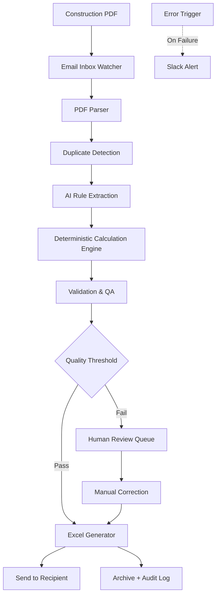
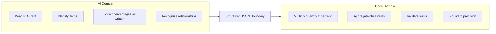
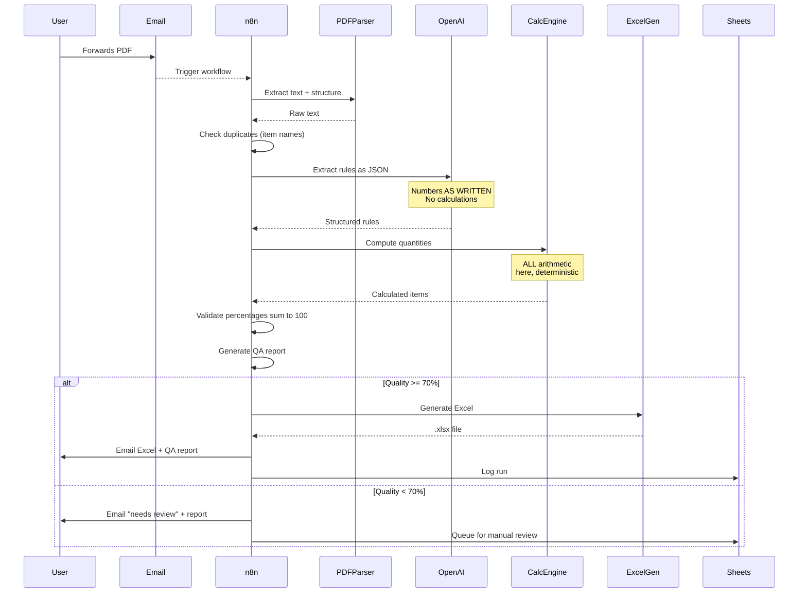

# Architecture — Document Automation System

PDF-to-Excel pipeline for construction specifications. **Core principle: AI for language, code for math.** The LLM never touches arithmetic.

---

## System diagram



## Critical principle visualization



**Why the split is rigid:** LLMs hallucinate numbers. In construction documents, a wrong calculation means real money lost or safety issues. By forcing arithmetic into deterministic code, this category of error is eliminated entirely.

## Processing flow



## Data transformation example

**Input PDF text:**
```
Item A (parent):
  Total quantity: 1000 units
  Sub-items:
    - Item A-1: 600 units (reuse 50%, dispose 30%, clean 20%)
    - Item A-2: 400 units (reuse 70%, dispose 20%, clean 10%)
```

**After AI extraction (JSON):**
```json
{
  "rules": [
    {
      "item_name": "Item A",
      "parent_item": null,
      "quantity": 1000,
      "actions": null
    },
    {
      "item_name": "Item A-1",
      "parent_item": "Item A",
      "quantity": 600,
      "actions": { "reuse_percent": 50, "dispose_percent": 30, "clean_store_percent": 20 }
    },
    {
      "item_name": "Item A-2",
      "parent_item": "Item A",
      "quantity": 400,
      "actions": { "reuse_percent": 70, "dispose_percent": 20, "clean_store_percent": 10 }
    }
  ]
}
```

**After deterministic calculation:**
```
Item A-1: reuse 300, dispose 180, clean_store 120 (sums to 600 ✓)
Item A-2: reuse 280, dispose 80, clean_store 40 (sums to 400 ✓)
Item A (parent): total children qty 1000, balanced ✓
```

**Final Excel output:** structured table with all calculated values, organized by parent → child hierarchy.

## Quality assurance layer

Every run generates a QA report:

| QA Check | What it validates |
|---|---|
| **Percent balance** | Each item's percentages sum to 100% |
| **Quantity conservation** | Sum of calculated actions equals total quantity |
| **Duplicate detection** | No item name appears twice in extraction |
| **Parent-child consistency** | Child quantities sum to parent total |
| **Completeness** | All items have quantity values |
| **Format integrity** | Generated Excel passes schema check |

**Quality score formula:**
```
score = (balanced_items / total_items) * 0.5
      + (no_duplicates ? 1 : 0.5) * 0.3
      + (completeness_ratio) * 0.2
```

Scores below 70% route to human review.

## Reliability features

| Feature | Implementation |
|---|---|
| **Idempotent processing** | Same PDF reprocessed = same output |
| **Auditable runs** | Every run has UUID, full log in Google Sheets |
| **QA report per run** | Operator knows what was processed and any concerns |
| **Graceful degradation** | Low-quality outputs route to humans, not silently shipped |
| **Sanitized error logs** | No client data in Slack alerts |
| **Retry logic** | PDF parsing retries on transient failures |

## Performance characteristics

- **Average processing time:** 15-30 seconds per PDF
- **Cost per document:** ~$0.05 (GPT-4 + storage)
- **Accuracy:** 100% on arithmetic (deterministic by design)
- **Extraction accuracy:** ~94% on text recognition (PDF quality dependent)
- **Manual review rate:** ~6% of documents (due to source ambiguity)
