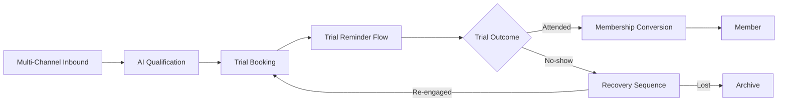
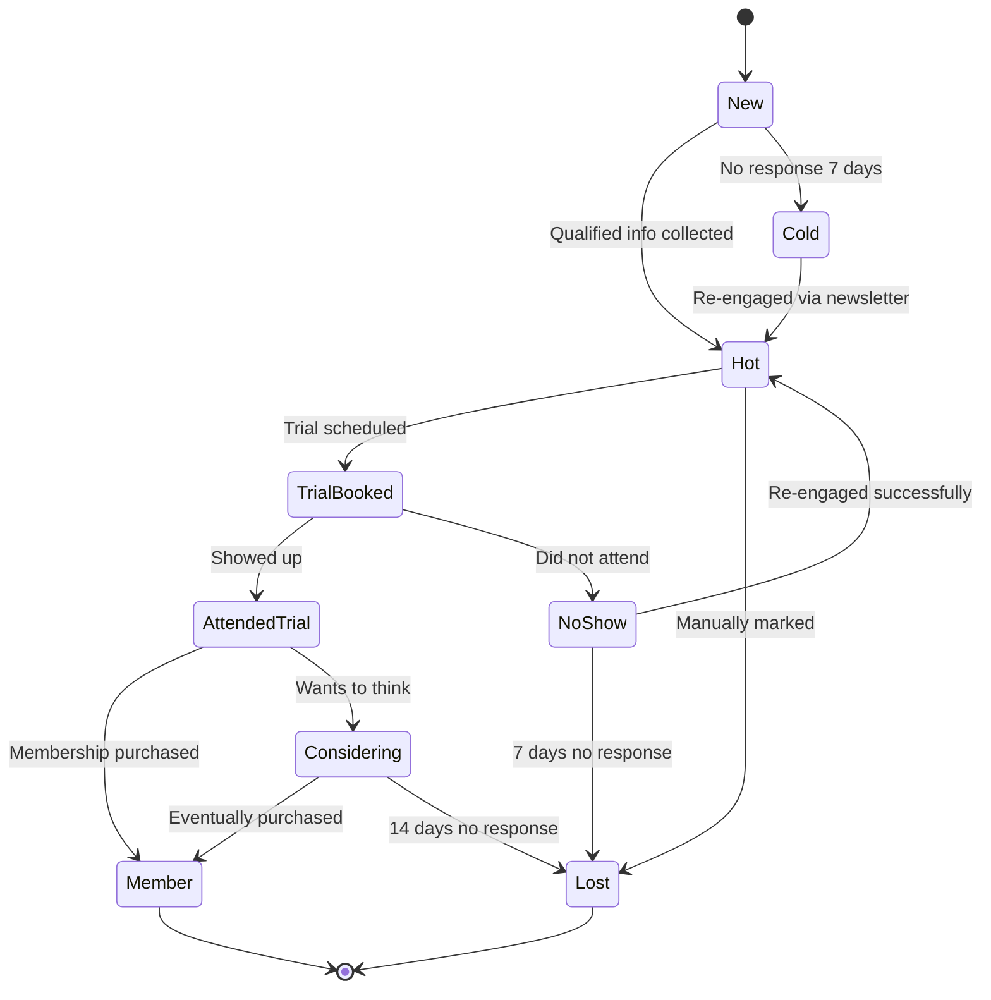
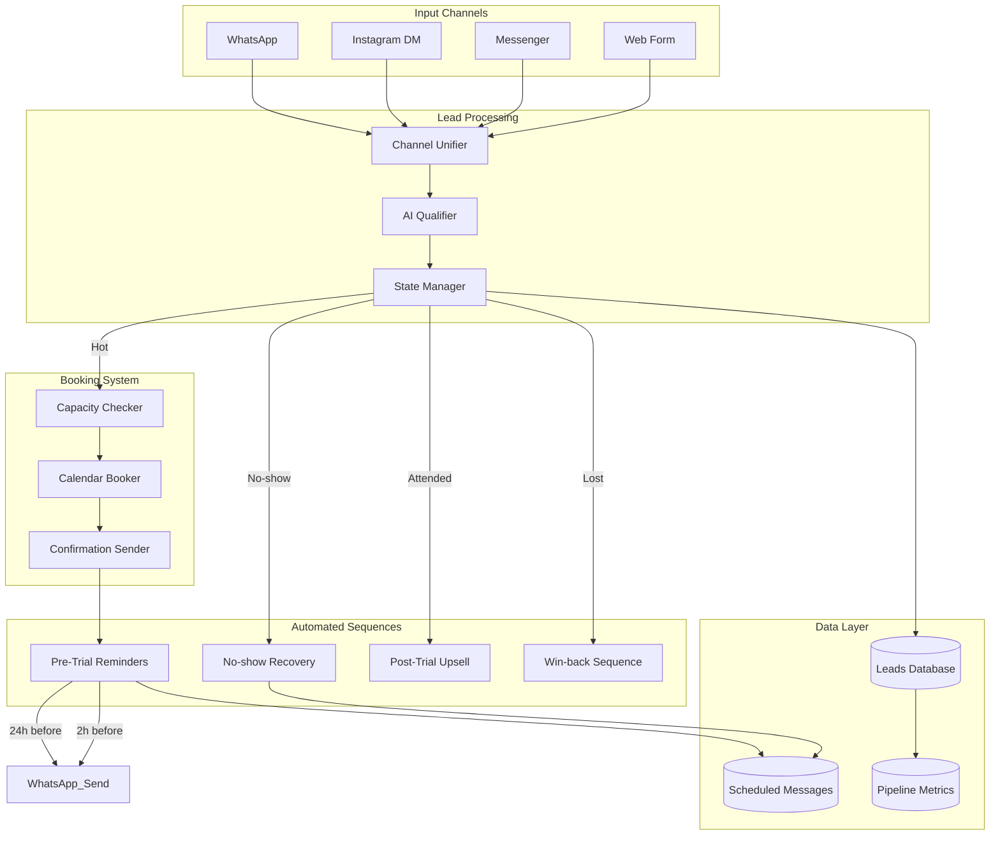
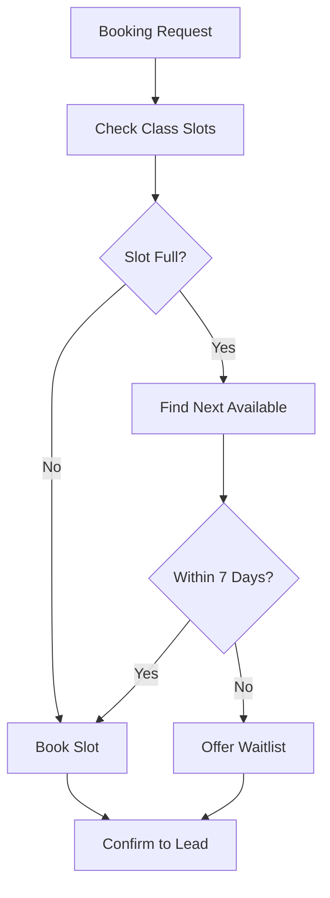

# Architecture — Gym Lead Management System

Capacity for 150+ leads/month with full pipeline tracking from inbound message to active member.

---

## High-level flow

## Lead pipeline state machine

## Component diagram

## Capacity management

Trial classes have limits. The system enforces these:

## Conversational qualification

Instead of forms, the AI gathers qualification info naturally over a conversation:

| Info needed | How collected |
|---|---|
| Name | Asked early if not in greeting |
| Fitness goals | Open-ended question, AI parses response |
| Experience level | Asked after goals |
| Preferred training time | Asked when ready to book |
| Preferred location (if chain) | Asked if multi-location |

**Result:** Higher completion rate than form-based qualification (~85% vs ~30%).

## Reminder sequence design

```mermaid
gantt
    title Trial Reminder Timeline
    dateFormat HH:mm
    axisFormat %H:%M
    
    section Day -1
    24h reminder           :24h, 18:00, 1h
    
    section Day 0
    2h reminder            :2h, 13:00, 30m
    Trial class            :trial, 15:00, 1h
    Post-trial follow-up   :post, 17:00, 1h
    
    section Day +1
    Membership offer       :offer, 09:00, 4h
    
    section Day +3
    Soft check-in          :check, 09:00, 4h
```

## No-show recovery sequence

When a lead misses a trial, a 3-step sequence runs over 7 days:

1. **+4 hours** — Soft check-in ("everything okay?")
2. **+48 hours** — Value reminder ("trial is still available, no pressure")
3. **+7 days** — Final offer ("last note, want to give it a shot?")

The sequence is **cancelled** if:
- Lead responds
- Lead is manually moved to "Member"
- Lead is manually moved to "Lost"

This prevents the embarrassing "we already became members and you're still messaging us" problem.

## Performance characteristics

- **Lead capacity:** 150+ leads/month with full traceability
- **Response time to inbound:** Under 90 seconds average
- **Trial booking conversion (Hot → Trial Booked):** ~60%
- **Trial attendance rate (after reminders):** ~75%
- **Member conversion (Attended → Member):** ~35%
- **End-to-end conversion (Inbound → Member):** ~16%
- **No-show recovery effectiveness:** ~20% return for re-attempted trial

## Reliability features

- Every state transition logged with timestamp
- Sequence cancellation triggers prevent annoying users
- Capacity checks prevent overbooked trials
- Multi-channel unification means no lost messages
- Error monitoring with Slack alerts
- Idempotent webhook processing
