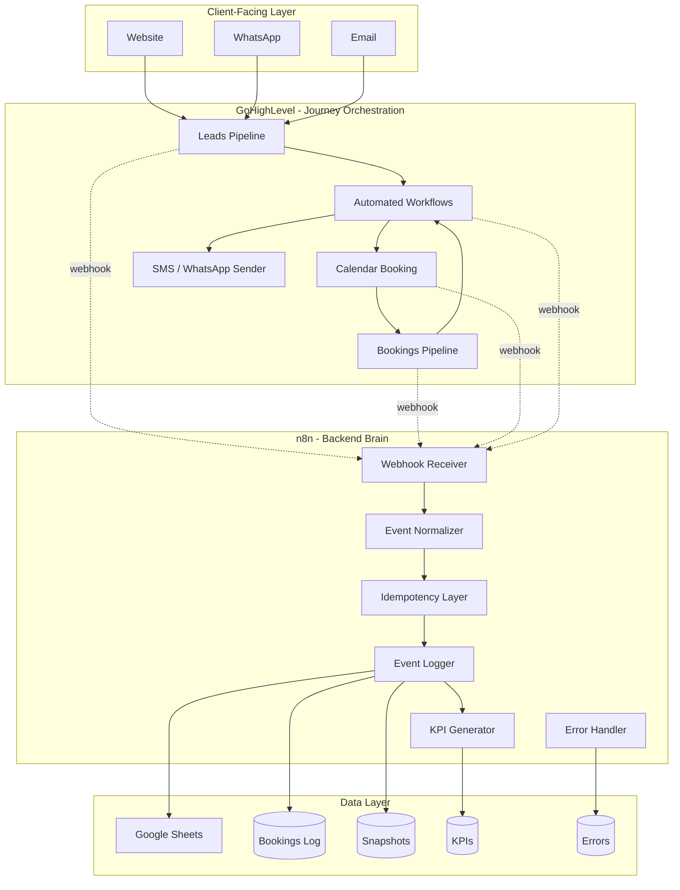
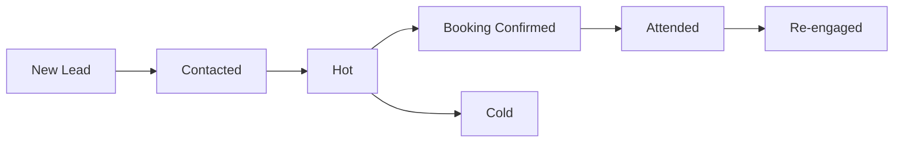
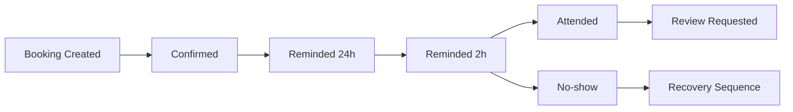
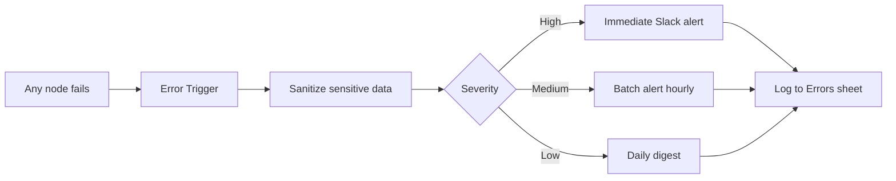

# Architecture — Holistic Wellness Club (GHL + n8n)

Dual-system architecture: **GoHighLevel handles the client journey, n8n handles the backend brain.** This separation lets each tool do what it does best.

---

## High-level architecture

## Why dual system?

| Need | GHL | n8n |
|---|---|---|
| Client-facing workflows | ⭐⭐⭐⭐⭐ | ⭐⭐⭐ |
| Visual pipeline editor | ⭐⭐⭐⭐⭐ | ⭐⭐⭐⭐ |
| Custom code/logic | ⭐⭐ | ⭐⭐⭐⭐⭐ |
| Multi-API integration | ⭐⭐⭐ | ⭐⭐⭐⭐⭐ |
| Error monitoring | ⭐⭐ | ⭐⭐⭐⭐⭐ |
| Detailed event logging | ⭐⭐ | ⭐⭐⭐⭐⭐ |
| Custom KPI generation | ⭐⭐ | ⭐⭐⭐⭐⭐ |

**Pattern:** Use GHL for what it does well (client journeys, simple workflows), use n8n for what it does well (custom logic, observability, integration glue).

## GoHighLevel layer

### Pipelines

**Pipeline 1: Leads**

**Pipeline 2: Bookings**

### Automated workflows in GHL
- Confirmation message on booking creation
- 24-hour SMS reminder
- 2-hour WhatsApp reminder
- Post-visit review request
- No-show recovery sequence (3 messages over 7 days)
- Re-engagement campaign for cold leads

## n8n layer

### Three core workflows

#### 1. Booking Event Logger
- Receives webhooks from GHL bookings pipeline
- Normalizes event schema
- Deduplicates via idempotency check
- Appends to Bookings Log sheet
- Creates daily snapshots in Bookings Snapshot sheet

#### 2. Lead Event Logger
- Receives webhooks from GHL leads pipeline
- Tracks every status change
- Calculates funnel position
- Computes time-to-conversion metrics

#### 3. Error Trigger
- Catches any failure in any n8n workflow
- Sanitizes sensitive data
- Logs to Errors sheet
- Sends Slack alert to team

### KPI generation

Daily snapshots compute:
- New leads (today vs yesterday)
- Bookings created
- Attendance rate
- No-show rate
- Average time from lead to booking
- Funnel conversion rates
- Channel performance breakdown

These flow into a single Google Sheets KPI dashboard accessible by the wellness club owners.

## Data layer (Google Sheets)

| Sheet | Purpose | Update frequency |
|---|---|---|
| **Bookings_Log** | Every booking event with full context | Real-time on webhook |
| **Bookings_Snapshot** | Daily aggregated booking metrics | Daily at midnight |
| **Leads_Log** | Every lead status change | Real-time on webhook |
| **Errors** | Any system failure with sanitized context | Real-time on error |
| **KPIs** | Daily KPI dashboard for stakeholders | Daily at 6 AM |

## Idempotency strategy

GHL retries webhooks on failure. Without idempotency, this creates duplicate log entries.

**Implementation:**
1. Check incoming event_id against recent events (last 24h)
2. Also check (contact_id + event_type + timestamp window) for retries with different IDs
3. If duplicate detected, log as `_idempotency: duplicate_skipped` and exit gracefully

## Error handling

## Performance characteristics

- **Webhook processing:** <500ms average
- **KPI snapshot generation:** ~5 seconds for full daily aggregation
- **Reliability:** 99.7% uptime over 6 months
- **Manual front-desk work reduced:** ~70%
- **Single source of truth:** Yes — all data flows through Sheets
