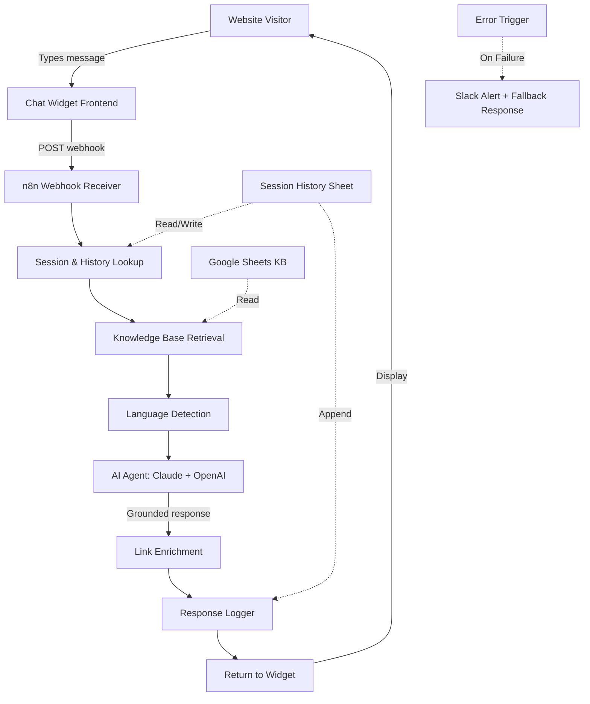
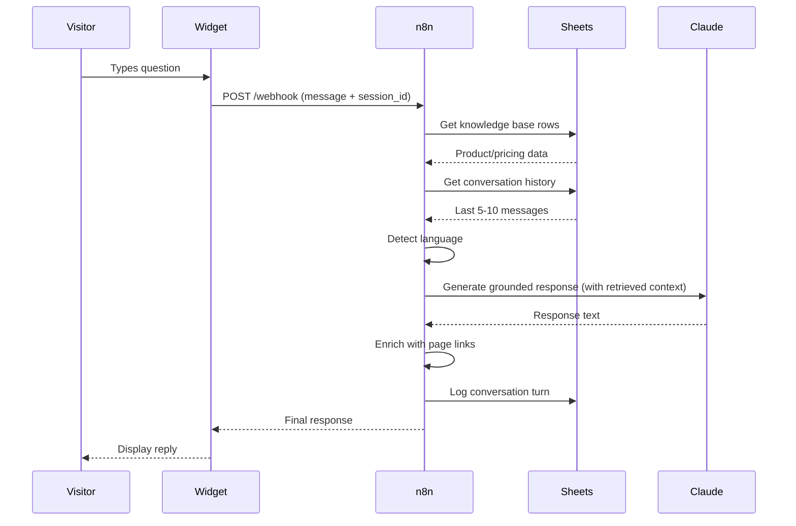

# Architecture — Hostzera AI Chat Widget

Retrieval-grounded AI chat widget designed for **zero hallucination**. The AI never answers from its own training — only from verified company data in Google Sheets.

---

## System diagram



## The retrieval-grounding principle

Most chat widgets hallucinate because they let the LLM use its training data. This system flips that:

**Standard chatbot:**
```
User: "How much does WordPress hosting cost?"
LLM: [Uses training data, possibly outdated or wrong]
Response: "WordPress hosting typically costs $5-15/month..."
```

**Retrieval-grounded (this system):**
```
User: "How much does WordPress hosting cost?"
Step 1: Retrieve from KB → Found row: "WordPress Hosting", "$8/month", "/wordpress"
Step 2: AI receives only this context
Step 3: AI responds: "Our WordPress Hosting is $8/month."
        OR (if not in KB): "Let me connect you with our team for that."
```

**Result:** Zero made-up prices. Zero outdated information. Zero embarrassment.

## Data flow detail



## Why this approach beats RAG with vector DBs (for this use case)

| Approach | Pros | Cons |
|---|---|---|
| **Vector DB RAG** | Scales to massive KBs, semantic search | Expensive, complex, embedding drift, requires re-indexing |
| **Google Sheets KB (this)** | Free, editable by non-technical staff, instant updates | Limited to <1000 rows efficiently |

For Hostzera's product catalog (~50 services), Sheets is the right tool. The non-technical team can update prices/descriptions directly without engineering involvement.

## Knowledge base structure

| Column | Purpose | Example |
|---|---|---|
| `product` | Searchable product name | "Business Email Hosting" |
| `description` | Detailed description | "Professional email with 50GB storage..." |
| `price` | Current price (always up-to-date) | "$12/month" |
| `tags` | Additional searchable keywords | "email, business, professional, smtp" |
| `url` | Direct link to product page | "/business-email" |
| `language` | Language variant (en/ar/etc.) | "en" |

## Multi-language support

The system detects language from the user's message and instructs the AI to respond in the same language. The knowledge base supports multiple language variants by adding a `language` column.

**Detected languages:**
- English (default)
- Arabic (Unicode range detection)
- Russian (Cyrillic detection)
- Chinese (CJK detection)

## Performance characteristics

- **Average response time:** 1.5–2.5 seconds
- **Cost per conversation:** ~$0.005 (5-10 turns)
- **Knowledge base size:** Supports up to ~500 products without performance impact
- **Concurrent sessions:** Tested to 30 simultaneous chats

## Reliability features

1. **Knowledge base fallback** — If Sheets API is unavailable, cached snapshot is used
2. **AI fallback** — If primary model (Claude) fails, falls back to OpenAI
3. **Polite refusal** — Out-of-scope questions never get fabricated answers
4. **Human handoff** — Complex questions route to support email/Slack
5. **Conversation summarization** — Long conversations get summarized to maintain context affordably
