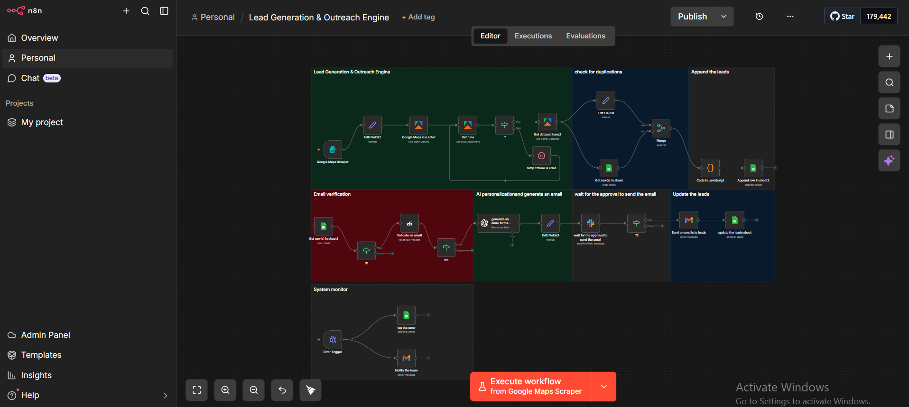

# Lead Generation & Outreach Engine

End-to-end lead scraping, email verification, AI-personalized outreach, and automated sending
(Google Maps Scraping · Email Verification · AI Personalization · Human Approval)

---



---

## What This System Does

A full lead generation and outreach pipeline that automates the entire process from **finding prospects** to **sending personalized outreach emails** — with built-in deduplication, email verification, AI-powered personalization, and human approval before sending.

**Key features:**

- Identifies and collects leads from targeted businesses using Google Maps scraping
- Extracts contact details — email addresses, phone numbers, company names, websites, and social profiles
- Checks for duplicates against existing lead database
- Verifies email addresses to ensure deliverability before outreach
- Generates personalized outreach emails using AI, tailored to each lead's business and pain points
- Waits for human approval before sending — no email goes out without review
- Updates the lead database with outreach status and tracking
- Monitors for errors and alerts the team if anything fails

---

## How It Works

### Phase 1: Lead Generation Engine
1. **Google Maps Scraper** — searches for businesses matching target criteria (industry, location, size)
2. **Edit Fields** — structures the raw scraped data
3. **Google Maps run actor** — executes the scraping job via Apify
4. **Get runs / Get dataset items** — retrieves the collected business data
5. **Retry if there is error** — built-in retry logic for failed scraping attempts

### Phase 2: Deduplication & Lead Storage
1. **Check for duplications** — compares new leads against existing database
2. **Edit Fields** — normalizes contact information (phone formats, email formats, names)
3. **Get rows in sheet** — loads existing leads from Google Sheets
4. **Merge** — combines new leads with existing data, removing duplicates
5. **Code in JavaScript** — custom deduplication and data cleaning logic
6. **Append row in sheet** — stores verified new leads in the database

### Phase 3: Email Verification
1. **Get rows in sheet** — loads leads pending email verification
2. **Validate email** (ZeroBounce) — verifies each email address for deliverability
3. **Filter** — separates valid emails from invalid ones

### Phase 4: AI Personalization & Email Generation
1. **Generate email** (OpenAI) — creates a personalized outreach email based on the lead's business, website, services, and potential pain points
2. **Edit Fields** — formats the generated email
3. **Review & edit** — human review step for quality control

### Phase 5: Approval & Sending
1. **Wait for approval** — pauses until a team member approves the email
2. **Send emails to leads** (Gmail) — sends the approved email
3. **Update the leads sheet** — marks the lead as contacted with timestamp

### Phase 6: System Monitor
- **Error Trigger** — catches any failure in the pipeline
- **Log the error** — records the failure in a dedicated error sheet
- **Notify the team** — sends an alert via email

---

## Workflow Architecture

```
Lead Generation Engine (scraping from Google Maps)
  → Check for Duplications → Append the Leads
    → Email Verification (ZeroBounce)
      → AI Personalization & Generate Email (OpenAI)
        → Wait for Approval → Send Email → Update Leads

System Monitor
  → Error Trigger → Log error + Notify team
```

---

## Stack

| Layer | Tools |
|---|---|
| **Orchestration** | n8n (self-hosted on VPS) |
| **Lead Scraping** | Google Maps Scraper (Apify actor) |
| **Email Verification** | ZeroBounce |
| **AI** | OpenAI (personalized email generation) |
| **Data** | Google Sheets (lead database, error logs, tracking) |
| **Outreach** | Gmail (email sending) |
| **Logic** | JavaScript (deduplication, data cleaning) |

---

## Outreach Focus Areas

The AI-generated emails target value propositions around:
- **Increasing revenue** — lead capture, conversion optimization
- **Reducing losses** — no-show recovery, missed inquiry prevention
- **Saving time** — automation of repetitive tasks
- **Reducing manual effort** — CRM updates, scheduling, follow-ups
- **Solving workflow problems** — multi-channel consolidation, data organization

---

## Impact

- **Automated prospecting** — finds and collects leads without manual research
- **Zero duplicate outreach** — deduplication prevents contacting the same business twice
- **Verified emails only** — email validation ensures high deliverability and protects sender reputation
- **Personalized at scale** — AI writes unique emails for each prospect, not templates
- **Human-in-the-loop** — approval step ensures quality control before any email is sent
- **Full audit trail** — every lead, email, and status change is tracked

---

## Notes

- The Google Maps scraping criteria (industry, location, keywords) are fully configurable per campaign
- The approval step is intentional — this is not a spam tool. Every email is reviewed before sending
- Built with production-grade error handling: retry logic on scraping, error logging, and team alerts
- Can be extended to include LinkedIn scraping, additional enrichment sources, and multi-channel outreach
