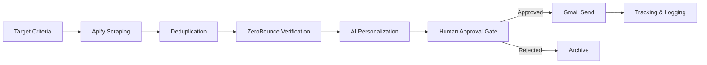
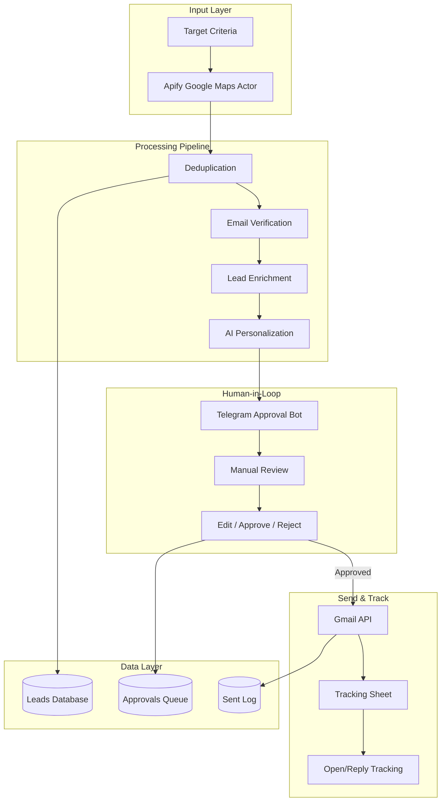
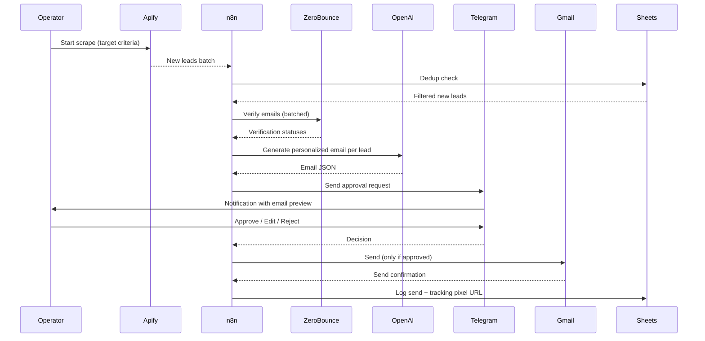

# Architecture — Lead Generation & AI Outreach Engine

End-to-end lead generation pipeline with mandatory human approval gates. Built for marketing agencies running cold outreach campaigns at scale without sacrificing sender reputation.

---

## High-level pipeline

## Detailed component view

## Phase-by-phase breakdown

### Phase 1 — Targeted Scraping
- **Tool:** Apify Google Maps Scraper actor
- **Input:** Search query (e.g., "dental clinics Cairo"), result limit
- **Output:** Business name, address, phone, website, hours, reviews summary
- **Critical config:** Respect Apify rate limits, use proxies for scale

### Phase 2 — Multi-Signal Deduplication
- **Inputs:** Newly scraped leads + existing database
- **Dedup signals:** email, phone (normalized), website domain
- **Why three signals:** Different businesses can share emails (catch-alls), phones can be miscaptured, but domain match is highly reliable
- **Output:** Filtered list of truly new leads

### Phase 3 — Email Verification
- **Tool:** ZeroBounce API
- **Cost:** ~$0.007 per verification
- **Why critical:** Sending to invalid emails destroys sender reputation; one bad campaign can land your domain in spam folders for months
- **Filter:** Only `valid` or `catch-all` statuses proceed (no `disposable`, `unknown`, `do_not_mail`)

### Phase 4 — AI Personalization
- **Model:** GPT-4 (quality matters more than speed)
- **Context provided:** Business name, industry, recent reviews, location, employee count
- **Output:** JSON with subject, body, personalization signal used
- **Quality enforcement:** Word limit (80 max), required CTA, cliché-free

### Phase 5 — Human Approval (CRITICAL GATE)
- **Tool:** Telegram bot with inline buttons
- **Review options:**
  - ✅ Approve (send as-is)
  - ✏️ Edit (modify subject/body, then approve)
  - ❌ Reject (with reason)
- **Why required:** AI personalization at scale + cold outreach = high spam risk without human filter
- **Timeout:** 48 hours; pending approvals auto-archive

### Phase 6 — Send & Track
- **Tool:** Gmail API (via OAuth)
- **Tracking:** Open tracking via 1px pixel, reply tracking via Gmail thread monitoring
- **Logging:** Every send recorded in Google Sheets with timestamp, approval ID, recipient

## Data flow

## Quality and reliability features

| Feature | Purpose |
|---|---|
| **Three-signal dedup** | Prevents duplicate outreach across channels |
| **ZeroBounce verification** | Protects sender reputation |
| **Retry logic with backoff** | Handles transient API failures gracefully |
| **Human approval gate** | No bulk-send disasters from AI hallucinations |
| **Approval timeout** | Prevents pending queue from growing unbounded |
| **Per-send tracking** | Full audit trail for compliance and analysis |
| **Rate limiting** | Stays under Gmail's daily send limits |
| **Error monitoring** | Slack alerts on any pipeline failure |

## Performance characteristics

- **Throughput:** 150+ qualified leads per month per active campaign
- **Verification cost:** ~$1.05 per 150 leads (ZeroBounce)
- **AI cost:** ~$1.50 per 150 personalized emails (GPT-4)
- **Approval time:** Average 4 hours from generation to send (operator dependent)
- **Bounce rate after verification:** <2% (vs. 15-25% without verification)
- **Reply rate:** 8-12% on well-targeted lists (industry average is 3-5%)
