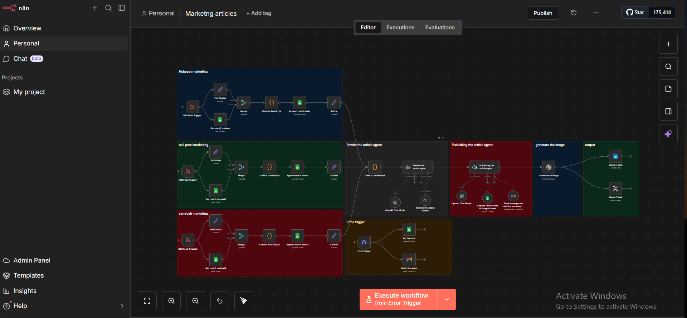

# Smart Marketing Lead Engine

Automation system that turns newly published articles into permission-based social posts and warm leads
(RSS Feeds · AI Content Generation · Author Permission · Auto-Publishing)

---



---

## Workflow Architecture

```
Schedule Trigger ──→ Fetch RSS / API articles
  → Check duplicates (URL in Google Sheets)
    → AI rewrite (OpenAI) ──→ LinkedIn post draft + Email pitch
      → Save drafts to Google Sheets
        → Send permission email to author
          → If YES → Auto-publish to LinkedIn + log
          → If NO  → Archive + log

Error Monitor ──→ Log failures + Alert team
```

---

## What This System Does

An automation system for marketing agencies that monitors content sources, generates AI-assisted social posts, and handles ethical outreach — all with author permission and full tracking.

- Pulls latest articles from RSS feeds and APIs on a schedule
- Uses AI to rewrite content into LinkedIn-style posts and email pitches
- Sends permission requests to original authors before publishing
- Auto-publishes approved content to social channels
- Tracks the full lifecycle: draft → permission → approved → published

---

## How It Works

1. **Fetch new articles**
   - Pulls latest articles from RSS / APIs on a schedule
   - Skips duplicates based on URL in Google Sheets

2. **Generate draft content**
   - Uses AI to rewrite the article into 1–2 LinkedIn-style posts
   - Creates a short email pitch summarizing the article
   - Saves drafts + metadata in Google Sheets

3. **Ask author for permission**
   - Sends a polite email to the original author
   - Shares the draft post and asks for clear YES / NO to publish and tag them
   - Updates status: pending / approved / declined / no response

4. **Auto-publishing**
   - If approved → posts automatically to LinkedIn / selected channels
   - Stores published_at + post URL for tracking

5. **Monitoring & errors**
   - Logs failures (API, email, etc.) to a Log sheet
   - Sends alerts on critical errors so flows can be fixed quickly

---

## Stack

| Layer | Tools |
|---|---|
| **Orchestration** | n8n (self-hosted on VPS) |
| **AI** | OpenAI (rewriting & summarizing) |
| **Data** | Google Sheets (content queue & status tracking) |
| **Email** | Gmail / SMTP (author outreach) |
| **Publishing** | LinkedIn / social APIs |

---

## Impact

- Builds a **consistent content pipeline** without constant manual writing
- Keeps outreach **ethical & permission-based** (no content theft)
- Gives agencies a clear history of who approved what, where it was posted, and what's still pending

---

## Notes

- This project demonstrates real-world marketing automation with approvals, logging, and monitoring
- The permission-based approach ensures compliance and builds genuine relationships with content creators
- Fully configurable: RSS sources, post templates, and publishing channels can be changed per campaign
