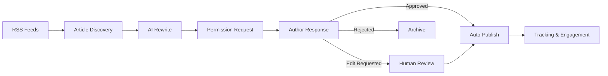
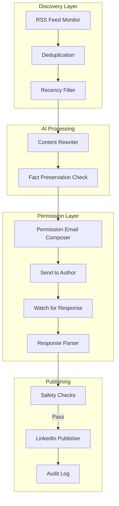
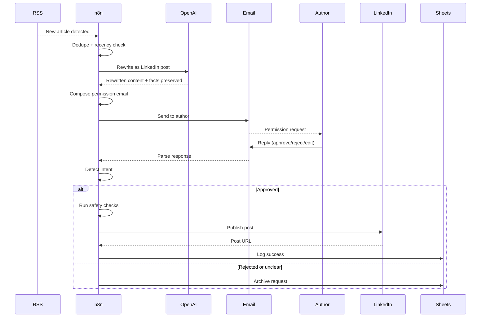
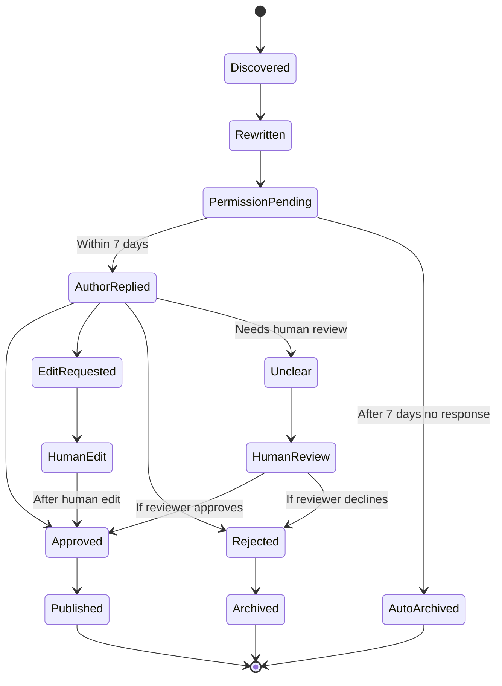

# Architecture — Marketing Content Engine

Ethical content marketing automation. **Permission-based, not theft-based.** Every published post is approved by the original author.

---

## High-level flow

## Detailed component diagram

## Sequence: from RSS to published post

## Ethical foundation

This system was designed specifically to be different from "content scraping" tools that republish others' work without permission.

**Standard content automation:**
- Scrapes articles
- Rewrites with AI
- Publishes as if original
- Hopes original author doesn't notice

**This system:**
- Discovers articles
- Rewrites with AI
- **Asks the author for permission**
- Only publishes with explicit approval
- Always credits the original
- Authors often appreciate being asked

**Result:** Better content relationships, no legal/ethical risk, and authors often share the rewrites themselves, multiplying reach.

## Permission flow detail

## Safety check layer

Before any post is published, 5 safety checks run:

1. **Has approval record** — explicit permission_request_id exists
2. **Status is approved** — detected_intent === 'approved'
3. **Not already published** — no prior publish for this article
4. **No human review flag** — automatic intent detection was confident
5. **Within freshness window** — article < 30 days old

**ALL must pass.** If any fails, the post is skipped and logged.

## Tracking layer

Every step is logged with timestamps:

| Event | Tracked data |
|---|---|
| Article discovered | URL, source feed, discovery time |
| Rewrite generated | Original + new + facts preserved |
| Permission requested | Author, email sent, deadline |
| Response received | Time, intent detected, raw response |
| Published | LinkedIn URL, audience reached |
| Engagement | Likes, comments, shares over 30 days |

## Performance characteristics

- **Articles processed per day:** 50-200 (across multiple feeds)
- **Permission request response rate:** ~25%
- **Approval rate among responders:** ~80%
- **Final publish rate:** ~20% of discovered articles
- **Author satisfaction:** High (qualitative — authors often share the rewrites)
- **Legal risk:** Eliminated by permission requirement
